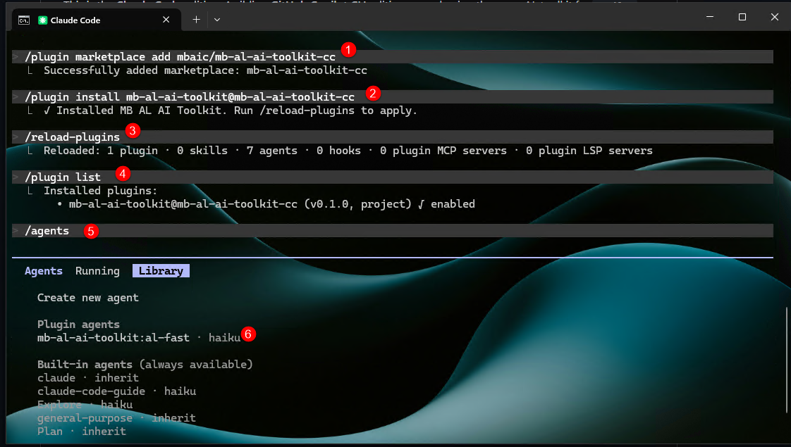
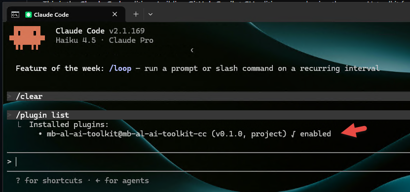
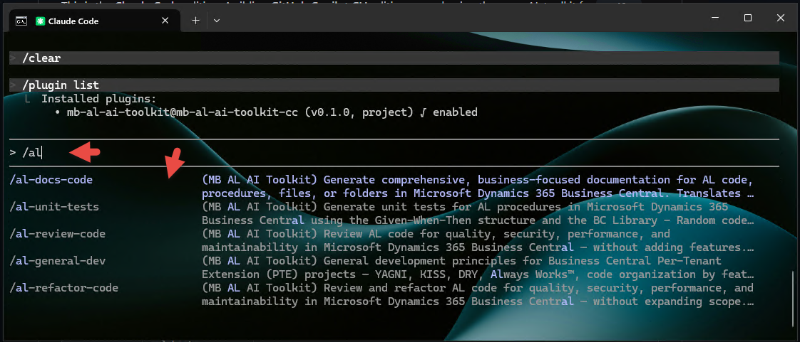
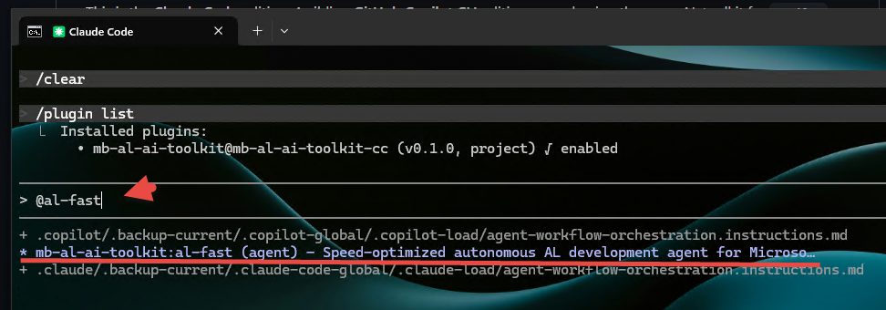

# MB AL AI Toolkit — Claude Code Plugin

Skills (also invocable as slash commands) and an autonomous agent for AL development in Microsoft Dynamics 365 Business Central, packaged as a Claude Code plugin.

> **Demo / showcase project.** This repository demonstrates how to package AL development tooling (prompts, coding standards, and a specialist agent) into a **Claude Code plugin**. It is **not published to any third-party plugin marketplace** — instead, the repo **doubles as its own marketplace** (`.claude-plugin/marketplace.json`) so you can install it directly from GitHub or a local clone. Use it as a reference template for building your own plugins.

This is the **Claude Code** edition. A sibling **GitHub Copilot CLI** edition — packaging the same AL toolkit for `copilot` — lives in the [`mb-al-ai-toolkit-cli`](https://github.com/mbaic/mb-al-ai-toolkit-cli) repository.

## What you get

| Component | Name | How it surfaces in Claude Code |
|---|---|---|
| Agent | `al-fast` | Speed-optimized autonomous AL development; pick it from `/agents` or let Claude auto-invoke it |
| Skill | `al-docs-code` | Run `/mb-al-ai-toolkit:al-docs-code`, or auto-loads when you ask to document AL code |
| Skill | `al-review-code` | Run `/mb-al-ai-toolkit:al-review-code`, or auto-loads when you ask to review AL code |
| Skill | `al-refactor-code` | Run `/mb-al-ai-toolkit:al-refactor-code`, or auto-loads when you ask to refactor AL code |
| Skill | `al-unit-tests` | Run `/mb-al-ai-toolkit:al-unit-tests`, or auto-loads when you ask for AL unit tests |
| Skill | `al-best-practices` | Auto-loads when you work in `*.al` files (`paths`-scoped) |
| Skill | `al-general-dev` | Auto-loads for PTE/BC general development principles |
| Skill | `al-sortrecordref` | Reference skill for sorting `RecordRef` dynamically |

Plugin slash commands are **namespaced** as `/<plugin>:<skill>` — e.g. `/mb-al-ai-toolkit:al-review-code`. Just type `/al` after install and Claude Code will filter to them. The same skills also **auto-activate** by description match, so you can phrase a request in natural language instead. The four action skills accept an AL snippet, a file path, or a folder path as `$ARGUMENTS` when run as a command.

## Requirements

- Claude Code 2.x or later (plugin support shipped in late 2025)
- AL workspace for a Business Central Per-Tenant Extension (PTE)
- For the `al-fast` agent's build cycle: `alc` (AL Compiler) reachable from the shell, or `dotnet` with the AL compiler installed as a tool

## Installation

> ⚠️ **Do not** copy the plugin folder into `~/.claude/plugins/` (or `%USERPROFILE%\.claude\plugins\`). That directory is managed internally by Claude Code — a manually copied folder is **not** detected and will not appear in `/plugin list`. Use one of the supported methods below.

### Option A — Install from GitHub (recommended, persistent)

Inside any Claude Code session:

```text
/plugin marketplace add mbaic/mb-al-ai-toolkit-cc
/plugin install mb-al-ai-toolkit@mb-al-ai-toolkit-cc
```


```text
/reload-plugins
```

`/reload-plugins` activates it immediately — no full restart needed.

### Option B — Install from a local clone (offline, persistent)

The repo is its own marketplace, so point `marketplace add` at the cloned folder:

```bash
git clone https://github.com/mbaic/mb-al-ai-toolkit-cc.git
```

Then, inside Claude Code (use the absolute path to the clone):

```text
/plugin marketplace add C:\path\to\mb-al-ai-toolkit-cc
/plugin install mb-al-ai-toolkit@mb-al-ai-toolkit-cc
/reload-plugins
```

(On macOS/Linux use the POSIX path, e.g. `/plugin marketplace add ~/code/mb-al-ai-toolkit-cc`.)

### Option C — Quick ad-hoc test (this session only)

Loads the plugin for a single session without installing it — handy while developing:

```bash
claude --plugin-dir ./mb-al-ai-toolkit-cc
```

### Verify

```text
/plugin list
```



You should see `mb-al-ai-toolkit` enabled. Type `/al` and confirm `/mb-al-ai-toolkit:al-docs-code`, `…:al-review-code`, `…:al-refactor-code`, and `…:al-unit-tests` appear. Run `/agents` to confirm `al-fast`.



## Usage

**Slash commands** — type the namespaced command followed by an AL snippet, a file path, or a folder:

```text
/mb-al-ai-toolkit:al-review-code app/src/Sales/SalesPostingMgt.Codeunit.al
/mb-al-ai-toolkit:al-unit-tests app/src/Posting
/mb-al-ai-toolkit:al-docs-code procedure CalculateBalance(CustomerNo: Code[20]): Decimal
```

**Natural language** — or just phrase the request, and Claude auto-selects the matching skill:

```text
review the AL code in app/src/Sales/SalesPostingMgt.Codeunit.al
write unit tests for app/src/Posting
document the procedure CalculateBalance in app/src/Customer/CustomerCalc.Codeunit.al
```

**Agent** — invoke `al-fast` explicitly, or let Claude auto-select it for fast, terminal-driven AL edits and build-error loops:

```text
@al-fast add a posting validation that blocks negative quantities
```



**Reference skills** — `al-best-practices` auto-loads whenever you touch `*.al` files, `al-general-dev` loads for PTE/BC principles, and `al-sortrecordref` activates whenever your prompt mentions `RecordRef`, `SortRecordRef`, `SetView`, or generic record sorting.

## Updating / uninstalling

```text
/plugin marketplace update mb-al-ai-toolkit-cc   # pull the latest from the source
/plugin uninstall mb-al-ai-toolkit@mb-al-ai-toolkit-cc
/plugin marketplace remove mb-al-ai-toolkit-cc
```

## Plugin layout

```
mb-al-ai-toolkit-cc/
├── .claude-plugin/
│   ├── plugin.json          # plugin manifest
│   └── marketplace.json     # lets the repo install itself as a marketplace
├── agents/
│   └── al-fast.md
├── skills/
│   ├── al-best-practices/SKILL.md
│   ├── al-general-dev/SKILL.md
│   ├── al-docs-code/SKILL.md
│   ├── al-review-code/SKILL.md
│   ├── al-refactor-code/SKILL.md
│   ├── al-unit-tests/SKILL.md
│   └── al-sortrecordref/
│       ├── SKILL.md
│       └── REFERENCE.md
├── README.md
├── CHANGELOG.md
└── LICENSE
```

## Notes

- The four action skills (`al-docs-code`, `al-review-code`, `al-refactor-code`, `al-unit-tests`) are the single source of truth for those prompts — invoked as namespaced slash commands or auto-activated by description match. There is no separate `commands/` folder.
- `al-fast` uses `model: haiku` for low-latency tool loops. Override per session via `/model` if you want Sonnet or Opus for harder refactors.
- `al-best-practices` is `paths`-scoped to `**/*.al`; it activates only when you're working inside AL source.
- The plugin bundles no `hooks/` block. Stage and commit AL changes through your normal git workflow.

## License

MIT — see [LICENSE](./LICENSE).
